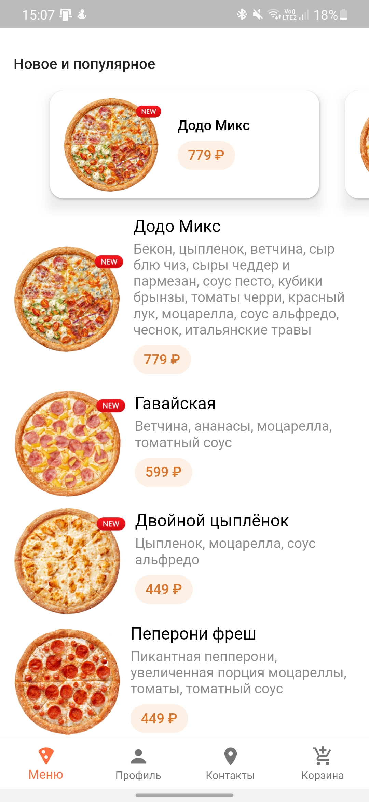
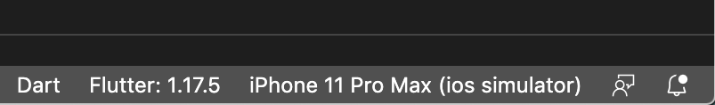

# Dodo pizza

It's my first flutter project - clone of mobile app dodo pizza.

<p float="left">
  
  
  
  
</p>

## Run the app

### Android studio


### Visual Studio code

1. Select a device


2. Invoke Run > Start Debugging or press F5


### Terminal

1. Check devices

```bash
flutter devices
```

2. Run the app

```bash
flutter run
```

## Contributing
Pull requests are not accepted. You can use this code however you want.

## License
[MIT](https://choosealicense.com/licenses/mit/)
